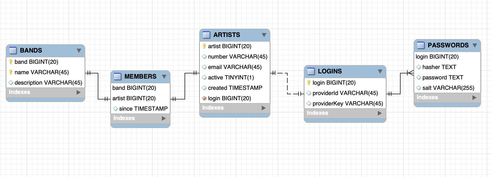

# Monad and Monadic Forms


* Creer un nouveau projet avec votre :id: en utillisant l'echaffaudage ci-dessous (Scaffold)

https://github.com/CollegeBoreal/play-slick-mysql.g8

* Modele

En fonction du modele suivant , 
```
  -  creer les fichiers `evolutions` nescessaire permettant :
     -> la creation de tables et 
     -> les enregistrements nesessaires 
  ```
  - creer les DAO correspondants




